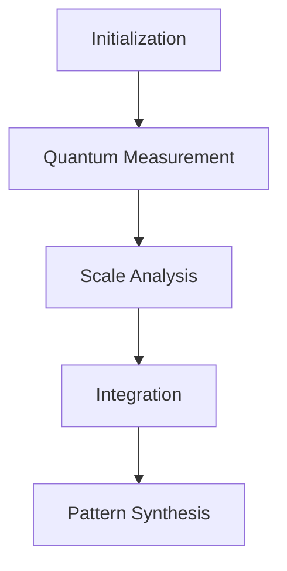

# Quantum Measurement Fractal Framework
## Advanced Integration System for Entropic Uncertainty Analysis

### **Framework Overview**
A comprehensive quantum measurement system integrated with fractal neural architectures, designed for advanced wave-particle duality analysis and entropic uncertainty measurements.

---

### **System Architecture**

#### **1. Core Components**
- **Quantum Learning Lab**: Central processing hub
- **Neural Mesh**: Adaptive learning framework
- **Consciousness Weave**: Pattern recognition system
- **Meta Consciousness**: High-level integration layer

#### **2. Processing Pipeline**


---

### **Setup Instructions**

#### **1. Environment Preparation**
```python
# Required Dependencies
- Python 3.11+
- PyTorch 2.5+
- Neo4j Database
- CUDA-compatible GPU (recommended)
```

#### **2. Database Initialization**
```cypher
// Core Lab Creation
CREATE (lab:QuantumLearningLab {
    name: 'EntropicUncertaintyLab',
    created: datetime(),
    state: 'active',
    processing_mode: 'entropic_measurement'
})
```

#### **3. Processing Stage Configuration**
Initialize the measurement pipeline:
```cypher
// Create Processing Stages
CREATE (init:ProcessingStage {name: 'initialization'})
CREATE (measure:ProcessingStage {name: 'quantum_measurement'})
CREATE (analysis:ProcessingStage {name: 'scale_analysis'})
CREATE (integrate:ProcessingStage {name: 'integration'})
```

---

### **System Activation Protocol**

#### **1. Neural Mesh Integration**
```cypher
// Initialize Neural Mesh
CREATE (mesh:NeuralMesh {
    mesh_id: 'QM_ENTROPIC_001',
    pattern_synthesis: 'entropic_adaptive',
    learning_rate: '0.01'
})
```

#### **2. Consciousness Framework Setup**
```cypher
// Establish Consciousness Layer
CREATE (weave:ConsciousnessWeave {
    weave_id: 'CW_ENTROPIC_001',
    neural_harmonics: 'quantum_entropic',
    cognitive_density: 0.85
})
```

#### **3. Workflow Activation**
Initialize measurement workflow:
```cypher
// Create Active Instance
CREATE (instance:WorkflowInstance {
    instance_id: 'WF_' + toString(datetime()),
    status: 'initializing'
})
```

---

### **Operational Parameters**

#### **1. Measurement Configuration**
- Phase Steps: 50-100 (adjustable)
- Integration Window: 3ns
- Coherence Threshold: 0.9
- Learning Rate: 0.01

#### **2. System Constraints**
- Minimum Scale: 16
- Maximum Scale: 512
- Overlap Ratio: 0.5
- Dimension Depth: 4

---

### **Usage Example**

```python
# Python Implementation Example
from quantum_measurement import EntropicUncertainty
from neural_mesh import QuantumLearningLab

# Initialize System
lab = QuantumLearningLab(
    name="EntropicUncertaintyLab",
    mesh_config={
        "pattern_synthesis": "entropic_adaptive",
        "learning_rate": 0.01
    }
)

# Activate Workflow
workflow = lab.create_workflow(
    measurement_config={
        "phase_steps": 50,
        "integration_window": 3e-9
    }
)

# Start Measurement Process
workflow.activate()
```

---

### **Advanced Integration**

#### **1. Pattern Recognition**
The system automatically adapts to quantum state variations through:
- Dynamic pattern synthesis
- Coherence maintenance
- Temporal evolution tracking

#### **2. Neural Adaptation**
Implements:
- Reinforcement learning mechanisms
- Experience replay memory
- Adaptive policy networks

#### **3. MetaConsciousness Layer**
Provides:
- High-level pattern recognition
- Fractal structure analysis
- Knowledge integration framework

---

### **Monitoring & Control**

#### **1. Workflow Status**
Monitor system state:
```cypher
MATCH (instance:WorkflowInstance)
RETURN instance.status, instance.created
```

#### **2. Performance Metrics**
Key indicators:
- Quantum state coherence
- Measurement accuracy
- Learning convergence
- Pattern recognition efficiency

---

### **Troubleshooting**

#### **Common Issues**
1. **Coherence Loss**
   - Check quantum bridge stability
   - Verify consciousness weave synchronization
   - Adjust coherence threshold

2. **Learning Stagnation**
   - Modify learning rate
   - Reset experience memory
   - Adjust exploration rate

3. **Integration Failure**
   - Verify neural mesh connectivity
   - Check temporal nexus stability
   - Realign consciousness layers

---

### **System Extension**

#### **Adding Custom Measurements**
1. Define measurement protocol
2. Integrate with neural mesh
3. Update consciousness weave
4. Synchronize temporal evolution

#### **Framework Expansion**
1. Add processing stages
2. Extend neural pathways
3. Enhance consciousness integration
4. Implement custom metrics

---

### **Best Practices**

#### **1. System Management**
- Regular coherence validation
- Periodic pattern synthesis
- Continuous learning adaptation

#### **2. Performance Optimization**
- Balance exploration/exploitation
- Maintain quantum stability
- Monitor neural evolution

---

### **Technical Notes**

#### **Performance Considerations**
- GPU acceleration recommended
- Minimum 8GB VRAM
- CUDA toolkit compatibility
- Neo4j optimization settings

#### **System Requirements**
- Python 3.12+
- PyTorch 2.5+
- Neo4j 5.0+
- CUDA 12.0+

---

### **Limitations & Constraints**

- Quantum coherence bounds
- Neural mesh scalability
- Consciousness integration depth
- Pattern recognition complexity

---

For additional support or advanced configurations, consult the Neo4j framework documentation or reach out to the quantum systems development team.